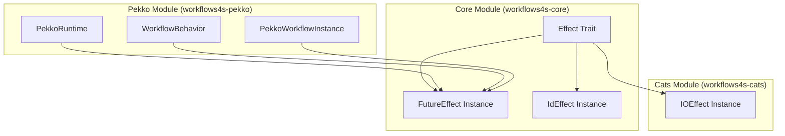

# Design Document: FutureEffect

## Overview

This design document describes the implementation of a `FutureEffect` type class instance and the migration of the Pekko runtime from `cats.effect.IO` to `scala.concurrent.Future`. The goal is to allow Pekko users to use workflows4s without requiring cats-effect as a dependency.

The existing codebase already has a `futureEffect` method in the `Effect` companion object that creates an `Effect[Future]` instance. The main work involves:
1. Exposing the `FutureEffect` as a proper given instance
2. Refactoring the Pekko module to use `Effect[Future]` instead of hardcoded `IO`
3. Updating examples to demonstrate Future-based usage

## Architecture



Note: `FutureEffect` lives in the core module (`workflows4s-core`) because it only depends on standard Scala libraries (`scala.concurrent.Future`, `scala.concurrent.ExecutionContext`). This keeps the dependency graph clean - users of the Pekko module don't need cats-effect unless they explicitly want to use `IO`.

## Components and Interfaces

### 1. FutureEffect (Enhanced)

The existing `futureEffect` method in the core module will be converted to a proper given instance that can be imported. This lives in `workflows4s-core` since it only depends on standard Scala libraries.

```scala
// In workflows4s-core/src/main/scala/workflows4s/runtime/instanceengine/Effect.scala
// Add to the Effect companion object:

object FutureEffect {
  /** Effect instance for scala.concurrent.Future.
    * Requires an implicit ExecutionContext.
    */
  given futureEffect(using ec: ExecutionContext): Effect[Future] = 
    Effect.futureEffect
}
```

Alternatively, the existing `futureEffect` method can be made into a given directly in the Effect companion object for easier importing.

### 2. WorkflowBehavior (Refactored)

The `WorkflowBehavior` will be parameterized by the effect type `F[_]` instead of hardcoding `IO`.

```scala
// Current signature
def apply[Ctx <: WorkflowContext](
    instanceId: WorkflowInstanceId,
    id: PersistenceId,
    workflow: WIO.Initial[IO, Ctx],
    initialState: WCState[Ctx],
    engine: WorkflowInstanceEngine[IO],
): Behavior[Command[Ctx]]

// New signature
def apply[F[_]: Effect, Ctx <: WorkflowContext](
    instanceId: WorkflowInstanceId,
    id: PersistenceId,
    workflow: WIO.Initial[F, Ctx],
    initialState: WCState[Ctx],
    engine: WorkflowInstanceEngine[F],
    runEffect: [A] => F[A] => Future[A],
): Behavior[Command[Ctx]]
```

### 3. PekkoRuntime (Refactored)

The `PekkoRuntime` will be parameterized to support different effect types while defaulting to `Future`.

```scala
// New signature
trait PekkoRuntime[F[_], Ctx <: WorkflowContext] {
  def templateId: String
  def workflow: Initial[F, Ctx]
  def createInstance(id: String): Future[WorkflowInstance[Future, WCState[Ctx]]]
  def createInstance_(id: String): WorkflowInstance[Future, WCState[Ctx]]
  def initializeShard(): Unit
}

object PekkoRuntime {
  // Convenience method for Future-based workflows
  def create[Ctx <: WorkflowContext](
      entityName: String,
      workflow: Initial[Future, Ctx],
      initialState: WCState[Ctx],
      engine: WorkflowInstanceEngine[Future],
  )(using
      system: ActorSystem[?],
      ec: ExecutionContext,
  ): PekkoRuntime[Future, Ctx]
}
```

### 4. Effect Runner

A new abstraction to convert from the workflow's effect type to `Future` for Pekko integration:

```scala
trait EffectRunner[F[_]] {
  def run[A](fa: F[A]): Future[A]
}

object EffectRunner {
  given futureRunner: EffectRunner[Future] = new EffectRunner[Future] {
    def run[A](fa: Future[A]): Future[A] = fa
  }
  
  // For backward compatibility with IO
  given ioRunner(using runtime: IORuntime): EffectRunner[IO] = new EffectRunner[IO] {
    def run[A](fa: IO[A]): Future[A] = fa.unsafeToFuture()
  }
}
```

## Data Models

No new data models are required. The existing `Outcome`, `Ref`, and `Fiber` types in the `Effect` module are sufficient.

## Correctness Properties

*A property is a characteristic or behavior that should hold true across all valid executions of a system-essentially, a formal statement about what the system should do. Properties serve as the bridge between human-readable specifications and machine-verifiable correctness guarantees.*

Based on the prework analysis, the following properties were identified as testable. After reflection, redundant properties were consolidated:

**Property Reflection:**
- Properties 1.3, 1.4, 1.5 (pure, flatMap, map) can be combined into monad law verification
- Properties 1.6, 1.7 (raiseError, handleErrorWith) can be combined into error handling round-trip
- Properties 2.4, 2.5 (createMutex, withLock) can be combined into mutex exclusivity

### Property 1: FutureEffect Monad Laws

*For any* value `a` of type `A`, function `f: A => Future[B]`, and function `g: B => Future[C]`:
- Left identity: `pure(a).flatMap(f)` equals `f(a)`
- Right identity: `fa.flatMap(pure)` equals `fa`
- Associativity: `fa.flatMap(f).flatMap(g)` equals `fa.flatMap(a => f(a).flatMap(g))`

**Validates: Requirements 1.3, 1.4, 1.5**

### Property 2: FutureEffect Error Handling Round-Trip

*For any* `Throwable` `e`, `raiseError(e).handleErrorWith(t => pure(t))` should complete successfully with value `e`.

**Validates: Requirements 1.6, 1.7**

### Property 3: Ref Atomic Update Consistency

*For any* initial value `a` and sequence of concurrent `update` operations, the final value of a `Ref` should be consistent with some sequential ordering of those updates (no lost updates).

**Validates: Requirements 2.1**

### Property 4: Mutex Exclusivity

*For any* mutex and two concurrent operations protected by `withLock`, their critical sections should never overlap in time.

**Validates: Requirements 2.4, 2.5**

### Property 5: GuaranteeCase Finalizer Execution

*For any* `Future[A]` computation and finalizer function:
- If the computation succeeds with value `a`, the finalizer is called with `Outcome.Succeeded(a)`
- If the computation fails with error `e`, the finalizer is called with `Outcome.Errored(e)`
- The finalizer is called exactly once

**Validates: Requirements 2.3**

### Property 6: Fiber Join Returns Correct Outcome

*For any* `Future[A]` computation started as a fiber:
- If the computation succeeds, `fiber.join` returns `Outcome.Succeeded(a)`
- If the computation fails, `fiber.join` returns `Outcome.Errored(e)`

**Validates: Requirements 2.2**

### Property 7: Delay Defers Execution

*For any* side-effecting computation wrapped in `delay`, the side effect should not execute until the resulting `Future` is evaluated.

**Validates: Requirements 1.9**

## Error Handling

### Effect Errors

- **Future failures**: All `Future` failures are captured and can be handled via `handleErrorWith`
- **Execution context unavailability**: If no `ExecutionContext` is available, compilation will fail with a clear error message
- **Mutex acquisition timeout**: The current implementation uses Java's `Semaphore` which blocks indefinitely; this matches the existing behavior

### Pekko Integration Errors

- **Actor termination**: If an actor terminates while processing, the `Future` will fail with the appropriate exception
- **Persistence failures**: Pekko's persistence layer handles these; they propagate as `Future` failures

## Testing Strategy

### Unit Tests

1. Test `FutureEffect` operations individually:
   - `pure`, `map`, `flatMap` basic operations
   - `raiseError` and `handleErrorWith` error handling
   - `delay` and `sleep` timing operations

2. Test concurrency primitives:
   - `Ref` atomic operations
   - `Mutex` locking behavior
   - `Fiber` start/join/cancel

### Property-Based Tests

Property-based tests will use ScalaCheck to verify the correctness properties:

1. **Monad laws**: Verify left identity, right identity, and associativity for `FutureEffect`
2. **Error handling**: Verify error propagation and recovery
3. **Concurrency**: Verify atomic operations and mutex exclusivity

### Integration Tests

1. **Pekko Runtime Tests**: Existing `PekkoRuntimeTest` will be updated to use `FutureEffect`
2. **Example Tests**: Verify that example applications work correctly with the new implementation

### Test Configuration

- Property tests: Minimum 100 iterations per property
- Timeout for Future-based tests: 5 seconds
- Use `ScalaCheck` for property-based testing
